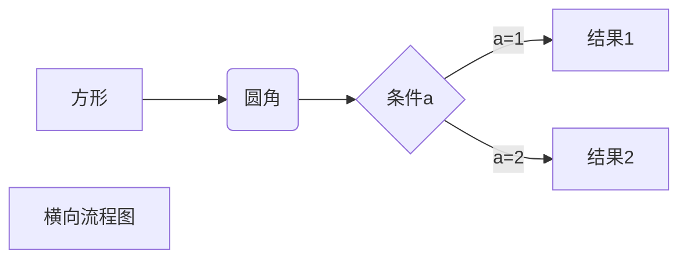
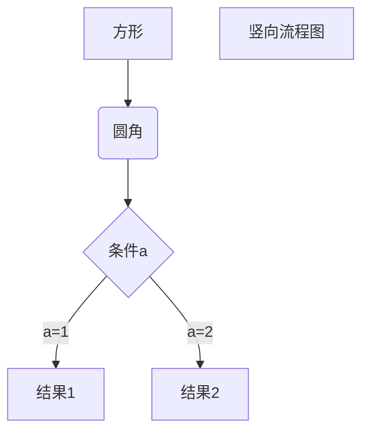
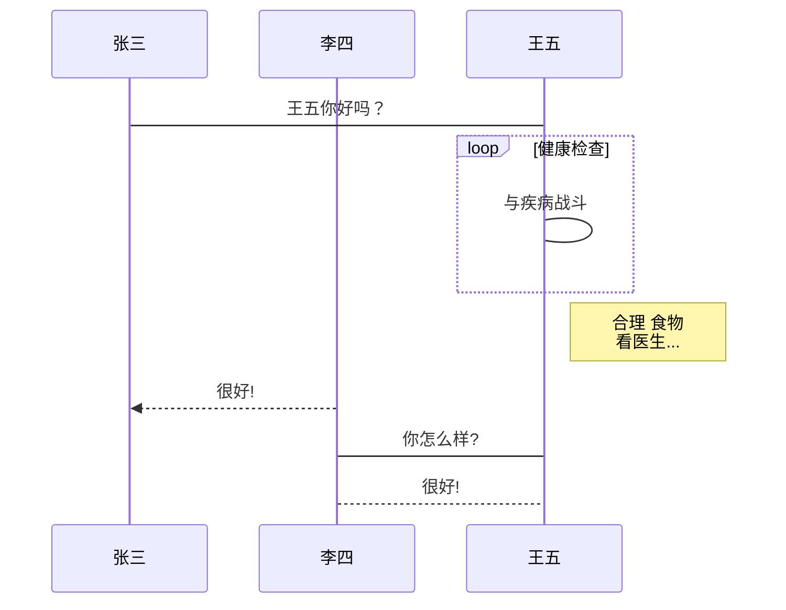

一级标题
=======

二级标题
---------

# 一级标题

## 二级标题

### 三级标题

#### 四级标题

##### 五级标题

######  六级标题


段落1  

段落3
*斜体*
_斜体_
**粗体**
***粗斜体***
___粗斜体___

分割线
************
------------
~~删除线~~

<u>下划线</u>

==批注==

脚注
(dd)[^脚注]
脚注<sup>真正的脚注</sup>

* 第一项
* 第二项
* 第三项

+ 第一项
+ 第二项
+ 第三项

- 第一项
- 第二项
- 第三项

1. 第一项
    - 第一个嵌套元素
    - 第二个嵌套元素
2. 第二项
3. 第三项

> 区块1

> 区块2

> 区块3


> 最外层
> > 第一层嵌套
> > > 第二层嵌套

> 区块中使用列表
>
> 1. 第一项
> 2. 第二项
>
> + 第一项
> + 第二项
> + 第三项

* 第一项
    > 菜鸟教程

    > 学的不仅是技术更是梦想
* 第二项

`printf()`

    <?php
    echo "HelloWorld"
    ?>

    printf()

``` javascript
    document.write("HelloWorld");
```

[我是连接](https://www.baidu.com)
<http://www.baidu.com>

[baidu][1]文末有赋值


|  表头   | 表头  |
|  ----  | ----  |
| 单元格  | 单元格 |
| 单元格  | 单元格 |

| 左对齐 | 右对齐 | 居中对齐 |
| :-----| ----: | :----: |
| 单元格gggg | 单元格gggg | 单元格gggg |
| 单元格 | 单元格 | 单元格 |

$ \int e^x $





```flow
st=>start: 开始框
op=>operation: 处理框
cond=>condition: 判断框(是或否?)
sub1=>subroutine: 子流程
io=>inputoutput: 输入输出框
e=>end: 结束框
st->op->cond
cond(yes)->io->e
cond(no)->sub1(right)->op
```

```flow
st=>start: 开始框
op=>operation: 处理框
cond=>condition: 判断框(是或否?)
sub1=>subroutine: 子流程
io=>inputoutput: 输入输出框
e=>end: 结束框
st(right)->op(right)->cond
cond(yes)->io(bottom)->e
cond(no)->sub1(right)->op
```

```sequence
对象A->对象B: 对象B你好吗?（请求）
Note right of 对象B: 对象B的描述
Note left of 对象A: 对象A的描述(提示)
对象B-->对象A: 我很好(响应)
对象A->对象B: 你真的好吗？
```

```sequence
Title: 标题：复杂使用
对象A->对象B: 对象B你好吗?（请求）
Note right of 对象B: 对象B的描述
Note left of 对象A: 对象A的描述(提示)
对象B-->对象A: 我很好(响应)
对象B->小三: 你好吗
小三-->>对象A: 对象B找我了
对象A->对象B: 你真的好吗？
Note over 小三,对象B: 我们是朋友
participant C
Note right of C: 没人陪我玩
```




[1]:http://www.baidu.com/